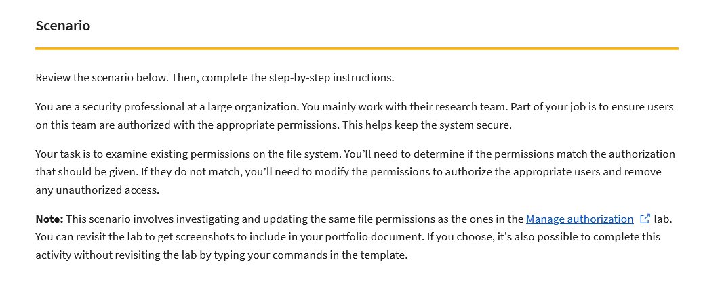

# Google-Cert-Linux-commands
A project made in Google Cybersecurity Certificate.

A portoflio activity in Google Cybersecurity Certificate to prove skills gain in Linux.

Main goal was to change permission to some files. I was given a scenario: 

File permissions at the start are shown in "Current file permissions.pdf" file and all my work with description is placed in "File permissions in Linux.pdf" file.
